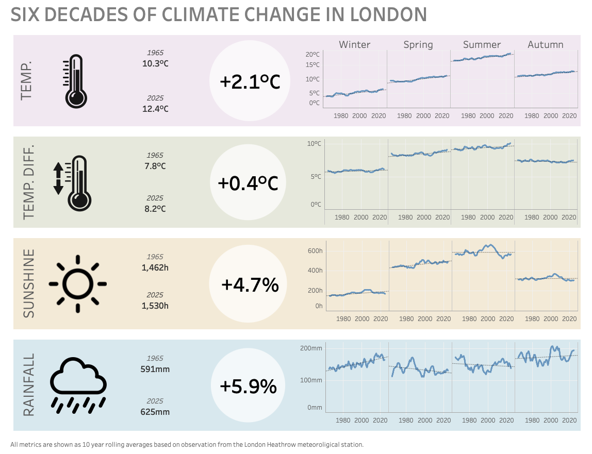

# London Weather Analysis (Heathrow Meteorological Station)

## Overview
This project cleans and analyzes long-run monthly weather observations for London (Heathrow).
The goal is to create reliable an analysis-ready dataset that can be used directly in Tableau for exploring seasonal patterns, trends,
and variability over time. 

## Objectives
- Standardize the raw Met Office text file into a clean CSV.
- Build monthly and seasonal tables suitable for time-series analysis.
- Quantify seasonal averages and rolling trends.
- Export a tidy dataset for Tableau.

## Data Source and Context
The raw file is `data/raw/heathrow_monthly_weather.txt`, a Met Office-style fixed-width file:
- Missing values are marked with `---` (and occasionally `--`).
- Estimated values use a trailing `*`.
- Sunshine can be marked with `#` when sourced from an automatic sensor.

These conventions require cleanup before analysis.

## Pipeline and Process
1. **Ingest and clean** (`notebooks/clean_up.py`)
   - Detect header row in the fixed-width file.
   - Normalize column names.
   - Replace missing markers with nulls.
   - Strip trailing quality flags (`*`, `#`) and coerce numeric columns.
   - Write `data/processed/heathrow_monthly_weather.csv`.
2. **Model and aggregate** (SQL in `sql/`)
   - `01_create_table.sql`: load the cleaned CSV into DuckDB.
   - `02_build_monthly_seasonal_table.sql`: create monthly/seasonal features and aggregates.
   - `03_add_season_rolling_trend.sql`: add 10-year rolling seasonal trends.
   - `99_export_for_tableau.sql`: export final table to CSV.
3. **Run the pipeline** (`notebooks/run_pipeline.py`)
   - Executes SQL scripts in order against `weather.duckdb`.

## Tools and Stack
- Python (pandas) for parsing and cleaning the raw text file.
- DuckDB for SQL-based modeling and aggregation.
- CSV outputs for downstream visualization (Tableau-ready).

## Outputs
- Cleaned input: `data/processed/heathrow_monthly_weather.csv`
- Final analysis table: `data/processed/london_weather_monthly_seasonal.csv`

## How to Run
```bash
python notebooks/clean_up.py
python notebooks/run_pipeline.py
```

## Key Insights (Summary)
Replace the bullet points below with your findings as you finalize the analysis.
- An increase of 2.1°C on average in the past 60 years.
- The increase in temperature is consistent accross all seasons.
- Spring and Summer have a significant wider temperature differences meaning more variations of temperature within each season.
- A significant brighter spring and slightly more sunny winter.
- In the mean time a much wetter winter.


## Tableau Dashboard - Six Decades of Climate Change in London

👉 **[View interactive dashboard on Tableau Public](https://public.tableau.com/views/SixDecadesofClimateChangeinLondon/Dashboard1?:language=en-GB&:sid=&:redirect=auth&:display_count=n&:origin=viz_share_link)**



## Repo Structure
```
data/
  raw/        # Original Met Office text file
  processed/  # Cleaned CSVs and export files
notebooks/    # Python scripts for cleanup and pipeline execution
sql/          # SQL transformations in DuckDB
src/          # Supporting scripts (e.g., data download)
```
